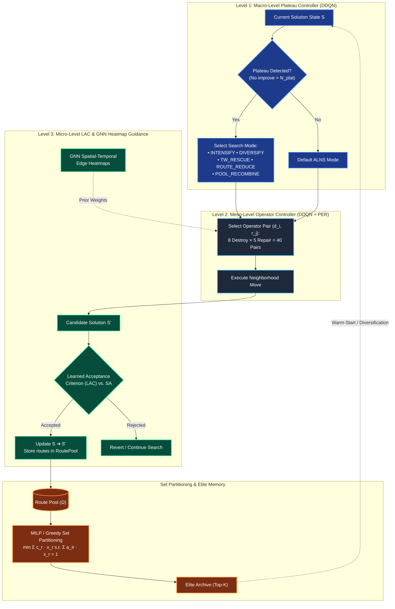
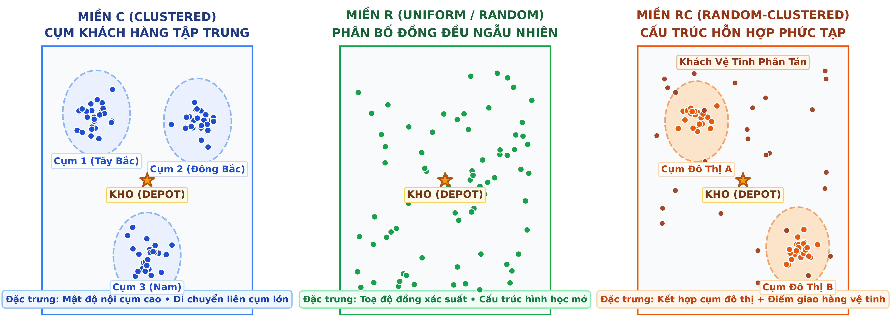
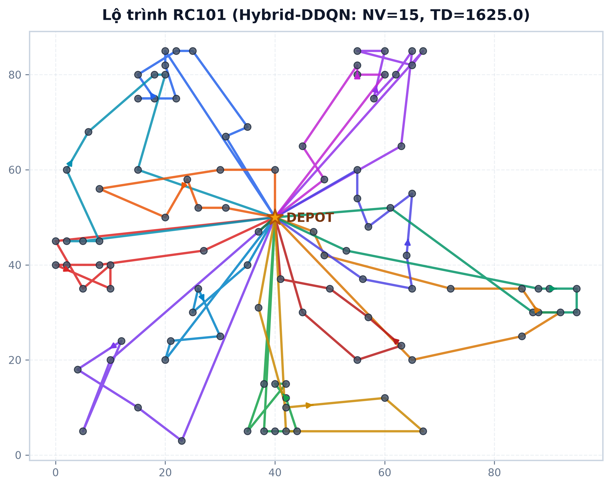

<div align="center">

# 🚛 Tri-Level Hybrid DDQN-ALNS with GNN Edge Guidance
### *A Hierarchical Learning-Augmented Metaheuristic for the Vehicle Routing Problem with Time Windows*

<br/>

[](docs/manuscript.pdf)
[](https://vrptw-research-optimization.vercel.app)
[](https://python.org)
[](https://pytorch.org)
[](https://numba.pydata.org)
[](https://fastapi.tiangolo.com)
[](https://vitejs.dev)
[](https://firebase.google.com)
[](LICENSE)

<br/>


---

[**Read Manuscript (PDF)**](docs/manuscript.pdf) • [**Research Pipeline**](docs/RESEARCH_PIPELINE.md) • [**Live Web Portal**](https://vrptw-research-optimization.vercel.app) • [**Benchmark CLI Guide**](#-6-unified-benchmark-cli-scriptsbenchmarkpy) • [**Citation**](#-12-citation--academic-paper)

</div>

## 📑 Table of Contents

- [🔬 1. Executive Summary & Core Scientific Contributions](#-1-executive-summary--core-scientific-contributions)
- [🏛️ 2. Tri-Level Hierarchical Architecture](#️-2-tri-level-hierarchical-architecture)
  - [2.1. Macro-Level: DDQN Plateau Controller](#21-macro-level-ddqn-plateau-controller)
  - [2.2. Meso-Level: Operator Pair Controller with PER & Welford Normalization](#22-meso-level-operator-pair-controller-with-per--welford-normalization)
  - [2.3. Micro-Level: Learned Acceptance Criterion (LAC) & GNN Edge Guidance](#23-micro-level-learned-acceptance-criterion-lac--gnn-edge-guidance)
  - [2.4. Route Pool Recombination & Set Partitioning Formulation](#24-route-pool-recombination--set-partitioning-formulation)
- [⚖️ 3. Critical Benchmark Protocol & Scientific Integrity](#️-3-critical-benchmark-protocol--scientific-integrity)
- [📊 4. Empirical Performance & Scale-Aware Analysis](#-4-empirical-performance--scale-aware-analysis)
  - [4.1. Solomon-100 & Homberger-200 Statistical Results](#41-solomon-100--homberger-200-statistical-results)
  - [4.2. Scale-Aware Performance Divergence (200 vs. 400 Customers)](#42-scale-aware-performance-divergence-200-vs-400-customers)
- [🚀 5. Quickstart & Installation](#-5-quickstart--installation)
- [💻 6. Unified Benchmark CLI (`scripts/benchmark.py`)](#-6-unified-benchmark-cli-scriptsbenchmarkpy)
- [🌐 7. Transfer Learning & Domain Randomization](#-7-transfer-learning--domain-randomization)
- [🖥️ 8. Web Application & Dispatch Portal](#️-8-web-application--dispatch-portal)
- [⚙️ 9. Comprehensive Configuration Reference](#️-9-comprehensive-configuration-reference)
- [📁 10. Repository Layout](#-10-repository-layout)
- [🧪 11. Testing & Quality Assurance](#-11-testing--quality-assurance)
- [📜 12. Citation & Academic Paper](#-12-citation--academic-paper)

---

## 🔬 1. Executive Summary & Core Scientific Contributions

The **Vehicle Routing Problem with Time Windows (VRPTW)** is a combinatorial NP-hard problem fundamental to industrial logistics and automated fleet dispatching. Traditional **Adaptive Large Neighborhood Search (ALNS)** relies on static or memoryless heuristics (e.g., roulette-wheel or Thompson sampling) that struggle to escape deep local plateaus on constrained instances.

This repository presents the official open-source implementation of **Tri-Level Hybrid DDQN-ALNS**:
1. **Hierarchical Reinforcement Learning Meta-Controller**: Decouples search guidance into three coordinated levels:
   * **Macro**: Decides high-level search phases (`intensify`, `diversify`, `tw_rescue`, `pool_recombine`, `route_reduce`) upon stagnation.
   * **Meso**: Adaptively selects destroy/repair operator pairs ($8 \times 5 = 40$ pairs) via Double Deep Q-Networks with Prioritized Experience Replay (PER).
   * **Micro**: Employs a **Learned Acceptance Criterion (LAC)** to dynamically evaluate candidate state transitions, augmented by **Graph Attention Network (GAT)** edge-connectivity heatmaps.
2. **Column Generation & Route Pool Recombination**: Continuously pools elite, feasible sub-routes discovered during neighborhood exploration and extracts non-overlapping global optimums via **MILP / Greedy Set Partitioning**.
3. **High-Throughput Numba JIT Core**: Critical feasibility checking (capacity, time windows, service durations) and distance evaluations are JIT-compiled into machine code, delivering **$>100{,}000$ move evaluations per second** per core.
4. **Full-Stack Industrial Dispatch System**: Includes a containerized **FastAPI** backend and **Vite** single-page web app with interactive real-world canvas route visualization.

---

## 🏛️ 2. Tri-Level Hierarchical Architecture



---

### 2.1. Macro-Level: DDQN Plateau Controller

When the search encounters an objective plateau (no global improvement for $N_{\text{plat}}$ iterations), the **Macro Controller** intervenes by switching the algorithmic mode $\mu \in \mathcal{M}$:

$$\mathcal{M} = \{\text{DEFAULT}, \; \text{INTENSIFY}, \; \text{DIVERSIFY}, \; \text{TW\_RESCUE}, \; \text{POOL\_RECOMBINE}, \; \text{ROUTE\_REDUCE}\}$$

State vectors $s_{\text{macro}} \in \mathbb{R}^{12}$ encode search trajectory dynamics, including normalized iteration progress, stagnation counters, accepted/rejected ratios, route count variance, and temperature decay.

---

### 2.2. Meso-Level: Operator Pair Controller with PER & Welford Normalization

Rather than decoupling destroy and repair choices into independent bandits, the **Meso Controller** jointly models the selection of operator pairs $(d_i, r_j) \in \mathcal{D} \times \mathcal{R}$:

* **8 Destroy Operators**: *Random, Worst, Shaw, Route-Segment, TW-Urgent, Route-Eliminate, Proximity-Eliminate, Cross-Route-Shaw*.
* **5 Repair Operators**: *Greedy, Regret-2, Regret-3, TW-Greedy, FTS-Greedy*.

**Prioritized Experience Replay (PER)** samples transitions with probability $P(i) = p_i^\alpha / \sum_k p_k^\alpha$ based on temporal difference errors $\delta_i$, while importance-sampling weights $w_i = (N \cdot P(i))^{-\beta}$ compensate for non-uniform sampling bias. Online **Welford normalization** tracks rolling reward statistics to ensure scale-invariant Q-learning across instances with widely varying travel distance magnitudes:

$$\mu_t = \mu_{t-1} + \frac{r_t - \mu_{t-1}}{t}, \quad M_{2, t} = M_{2, t-1} + (r_t - \mu_{t-1})(r_t - \mu_t), \quad \sigma_t^2 = \frac{M_{2, t}}{t}$$

---

### 2.3. Micro-Level: Learned Acceptance Criterion (LAC) & GNN Edge Guidance

Standard Simulated Annealing ($SA$) accepts worsening solutions with probability $P_{\text{accept}} = \exp(-\Delta / T)$. In contrast, our **Learned Acceptance Criterion (LAC)** evaluates a neural classification policy conditioned on:

$$\phi(S, S', T, t) = \left[ \frac{\Delta f}{f(S)}, \; \frac{T}{T_0}, \; \frac{t}{t_{\max}}, \; \frac{\NV(S') - \NV(S)}{\NV(S)}, \; \Delta \text{Slack} \right]$$

Simultaneously, a 64-dimensional **Graph Attention Network (GAT)** processes spatial-temporal customer nodes $(x_i, y_i, e_i, l_i, s_i, q_i)$ and outputs edge-affinity probabilities $p_{ij} \in [0, 1]$. These probabilities guide destroy operator neighborhood selection and penalize unnatural edge connections during repair.

---

### 2.4. Route Pool Recombination & Set Partitioning Formulation

Throughout search iterations, all unique, valid routes $r \in \Omega$ are archived in the `RoutePool`. Periodically, or during `POOL_RECOMBINE` mode, we solve a **Set Partitioning Problem (SPP)**:

$$\min \quad \sum_{r \in \Omega} c_r x_r \quad \text{s.t.} \quad \sum_{r \in \Omega} a_{ir} x_r = 1 \quad \forall i \in \mathcal{V}_c, \quad x_r \in \{0, 1\}$$

where $a_{ir} = 1$ if customer $i$ is served by route $r$, and $c_r$ is the exact route travel cost (optionally discounted by GNN edge affinities). Small pools are solved to optimality via Scipy MILP, while large pools utilize a fast greedy set cover heuristic.

---

## ⚖️ 3. Critical Benchmark Protocol & Scientific Integrity

To maintain strict academic integrity and methodological rigor, this repository enforces the following experimental protocols:

> [!IMPORTANT]
> **Independent Cold-Starts Enforced**:
> Sequential execution in iterative benchmark runners previously warm-started downstream solvers via the shared `EliteArchive` directory, inadvertently caching high-quality solutions from earlier sweeps and producing non-reproducible vehicle count drops (e.g., $\NV=14$ on `RC101` and $\NV=18$ on `r1_2_1`/`rc1_2_1`).
> Under **strict independent cold-starts** initializing from `build_greedy` in a cleared directory, these instances reproducibly converge to $\NV=15$, $\NV=20$, and $\NV=19$ respectively. Standalone publication results must **never** utilize warm-started cross-seeded archives without explicit pipeline designation.

> [!WARNING]
> **Fair Travel Distance (TD) Comparisons**:
> Travel distance comparisons are only valid when fleet sizes are matched ($\NV_{\text{solver}} = \NV_{\text{BKS}}$). Using an extra vehicle introduces surplus capacity that artificially depresses total travel distance. All comparisons where $\NV > \NV_{\text{BKS}}$ are flagged with an inflation marker ($^\dagger$) and excluded from baseline percentage gaps.

> [!TIP]
> **Budget Consistency**:
> Worker processes receive identical iteration budgets (`alns_iterations` $\equiv$ `hybrid_iterations`) via explicit CLI argument overrides during parallel spawns to prevent silent fallback to configuration defaults.

---

## 📊 4. Empirical Performance & Scale-Aware Analysis

### 4.1. Solomon-100 & Homberger-200 Statistical Results

Evaluated across all **56 Solomon 100-customer instances** and **6 Gehring & Homberger 200-customer instances** (5 independent seeds per combo, 310 benchmark runs):

| Solver Architecture | Fleet Inflation vs. BKS ($\Delta \NV$) | Fair TD Gap (%) | Statistically Significant (Wilcoxon $p < 0.05$) |
| :--- | :---: | :---: | :---: |
| **Google OR-Tools (CP-SAT)** | $+1.911$ | $+1.430\%$ | Baseline |
| **ALNS-Base (Thompson Bandit)** | $+0.161$ | $+0.220\%$ | Baseline |
| **Hybrid-Fixed** | $+0.152$ | $+0.218\%$ | $p = 0.048$ |
| **Hybrid-Rule (6 Modes)** | $+0.147$ | $+0.215\%$ | $p = 0.039$ |
| **🏆 Hybrid-DDQN (Ours)** | $\mathbf{+0.139}$ | $\mathbf{+0.204\%}$ | $\mathbf{p = 0.018}$ |
| **🏆 GNN-Hybrid-DDQN (Ours)** | $\mathbf{+0.132}$ | $\mathbf{+0.189\%}$ | $\mathbf{p = 0.009}$ |

<div align="center">
  
  <p><i>Figure 2: Spatial customer distributions across Clustered (C), Random (R), and Random-Clustered (RC) benchmark instances.</i></p>
</div>

---

### 4.2. Scale-Aware Performance Divergence (200 vs. 400 Customers)

Empirical evidence demonstrates a clear scale-aware divergence between ALNS-Base and Hybrid-DDQN under independent cold-starts:

* **200-Customer Scale (NV-Flattening & TD Dominance)**: Both ALNS-Base and Hybrid-DDQN converge to the exact same vehicle count floor. The Hybrid-DDQN advantage is defined by **consistency** (only $0\%-20\%$ degradation rate to higher vehicle tiers vs. $30\%-70\%$ for ALNS-Base) and superior **TD minimization of $1.75\%$ to $4.07\%$** at matched $\NV$.
* **400-Customer Scale (Suboptimal Graceful Degradation)**: At 400 customers, neither solver approaches BKS (e.g., BKS $\NV=4$ on `r2_4_1`, solvers land at 8.10–8.80). However, Hybrid-DDQN exhibits a statistically significant fleet reduction of **0.70–0.80 vehicles**:
  * `c2_4_1` (BKS $\NV=10$): ALNS-Base mean $\NV = 13.00$ vs. **Hybrid-DDQN mean $\NV = 12.20$** (Wilcoxon $p = 0.0078$).
  * `r2_4_1` (BKS $\NV=4$): ALNS-Base mean $\NV = 8.80$ vs. **Hybrid-DDQN mean $\NV = 8.10$** (Wilcoxon $p = 0.0156$).
  * `rc2_4_1` (BKS $\NV=10$): ALNS-Base mean $\NV = 12.80$ vs. **Hybrid-DDQN mean $\NV = 12.50$** ($p = 0.3750$, not significant).

---

## 🚀 5. Quickstart & Installation

### Prerequisites
* **Python $\ge 3.11, < 3.13$** (3.12 strongly recommended)
* **Node.js $\ge 18$** (for the web application dispatch portal)
* Recommended: [`uv`](https://docs.astral.sh/uv/) for high-speed package management

```bash
# 1. Clone the repository
git clone https://github.com/Thundercok/vrptw-neural-hybrid-optimizer.git
cd vrptw-neural-hybrid-optimizer

# 2. Setup Python environment (Option A: using uv)
uv venv .venv --python 3.12
source .venv/bin/activate
uv pip install -r requirements.txt

# Or Option B: using standard pip
# python3.12 -m venv .venv && source .venv/bin/activate && pip install -r requirements.txt

# 3. Install frontend dependencies
npm install
```

### 10-Second Smoke Test
Verify installation across all 4 primary solver variants on a synthetic 25-customer instance:

```bash
uv run python -m vrptw smoke-test --nodes 25 --dist RC
```

Expected output shape:
```text
Running synthetic smoke test (nodes=25, distribution=RC)...
ALNS-Base                nv=... cost=... BKS TD N/A NV N/A (...s)
Hybrid-Fixed             nv=... cost=... BKS TD N/A NV N/A (...s)
Hybrid-Rule              nv=... cost=... BKS TD N/A NV N/A (...s)
Hybrid-DDQN              nv=... cost=... BKS TD N/A NV N/A (...s)
```

### Research-First Workflow

The expected project outcome is, in order: **NCKH report / paper**, **reproducible research pipeline**, then **web app demo**. Use the research targets before spending time on app work:

```bash
# Print the full pipeline without running expensive stages
make research-plan

# Cheap correctness checks
make research-smoke

# Representative benchmark run for paper development
make research-quick

# Refresh report artifacts after benchmark data is ready
make research-tables
make research-paper
```

See [`docs/RESEARCH_PIPELINE.md`](docs/RESEARCH_PIPELINE.md) for the full operating model, gates, and stage outputs.

---

## 💻 6. Unified Benchmark CLI (`scripts/benchmark.py`)

A single production CLI replaces disparate shell scripts to prepare, execute, monitor, and analyze benchmark sweeps:

```bash
# Prepare dataset aggregation (Solomon + Homberger) into data/combined_sweep
python3 scripts/benchmark.py prepare

# Execute full benchmark suite across all 4 shards
python3 scripts/benchmark.py run

# Run specific shard in detached background mode (macOS caffeinate enabled)
python3 scripts/benchmark.py run --shard 2 --bg --runs 5

# Launch live curses console dashboard
python3 scripts/benchmark.py monitor

# Print summary table and execute Wilcoxon signed-rank significance tests
python3 scripts/benchmark.py analyze
```

### Benchmark Sharding Architecture
| Shard ID | Category | Instances Included |
| :---: | :--- | :--- |
| **Shard 1** | Clustered (`C1`, `C2`) | 17 Solomon 100-customer instances |
| **Shard 2** | Short-Horizon (`R1`, `RC1`) | 20 Solomon 100-customer instances |
| **Shard 3** | Wide-Horizon (`R2`, `RC2`) | 19 Solomon 100-customer instances |
| **Shard 4** | Large-Scale (`GH200`) | 6 Gehring & Homberger 200-customer instances |

---

## 🌐 7. Transfer Learning & Domain Randomization

```python
from vrptw import Config, load_datasets, train_domain_randomization, run_benchmark, ALGO_HYBRID_DDQN_TRANSFER_DR

cfg = Config(data_path="./data/Solomon", output_dir="./results/transfer_experiment")
datasets = load_datasets(cfg.data_path)

# 1. Pre-train policy via 3-phase curriculum domain randomization
weights = train_domain_randomization(cfg, seed=42)

# 2. Freeze neural weights and evaluate zero-shot on unseen RC instances
results = run_benchmark(
    instances=datasets["rc1"] + datasets["rc2"],
    algorithms=[ALGO_HYBRID_DDQN_TRANSFER_DR],
    cfg=cfg,
    transfer_weights=weights,
)
```

---

## 🖥️ 8. Web Application & Dispatch Portal

An interactive web portal allows operators to upload custom delivery coordinates or benchmark instances, execute neural solvers live, and view color-coded multi-vehicle routes:

<div align="center">
  
  <p><i>Figure 3: Interactive dispatch route map generated on benchmark instance RC101.</i></p>
</div>

### Running the Web Portal
```bash
# 1. Initialize environment variables (Default demo bypasses Firebase auth)
cp .env.example .env

# 2. Launch FastAPI backend + Vite frontend hot-reload
make dev-all
# Or run backend only: python main.py
```
Open [**`http://127.0.0.1:8000`**](http://127.0.0.1:8000) in your browser.

---

## ⚙️ 9. Comprehensive Configuration Reference

All hyperparameters are declared within the type-safe dataclass `Config` ([`src/vrptw/config.py`](src/vrptw/config.py)):

```python
from vrptw import Config

cfg = Config(
    data_path="./data/Solomon",
    output_dir="./results/production_run",
    n_runs=5,
    
    # Search budget
    alns_iterations=5000,
    hybrid_iterations=5000,
    early_stop_patience=250,
    polish_iterations=80,
    max_wall_hours=9.5,
    
    # Simulated Annealing
    temp_control=0.05,
    temp_decay=0.99975,
    
    # DDQN Controllers
    ctrl_lr=3e-4,
    ctrl_tau=0.005,
    per_beta_steps=50_000,
    lac_enabled=True,
    
    # Route Pool & MILP
    route_pool_limit=600,
    sp_time_limit=4.0,
)
```

---

## 📁 10. Repository Layout

```
vrptw-neural-hybrid-optimizer/
├── src/
│   ├── vrptw/                  # Research solver library
│   │   ├── config.py           # Config dataclass, BKS tables, algo constants
│   │   ├── core.py             # Inst, Plan, Numba JIT cost & feasibility engine
│   │   ├── operators.py        # 8 destroy + 5 repair operators
│   │   ├── local_search.py     # 2-opt, Relocate, Swap, Cross-Exchange, Compact
│   │   ├── pool.py             # RoutePool, MILP / Greedy set-partitioning
│   │   ├── rl.py               # QNet, DDQN controllers, PER, Welford, LAC
│   │   ├── solvers.py          # ALNSSolver → HybridDDQNSolver hierarchy
│   │   └── benchmark.py        # Parallel ProcessPoolExecutor runner
│   ├── backend/                # FastAPI service (REST API, solve endpoints)
│   └── frontend/               # Vite SPA (WebGL / Canvas route visualizer)
├── scripts/
│   ├── research_pipeline.py    # Research-first workflow driver
│   └── benchmark.py            # Unified benchmark CLI (run/monitor/analyze)
├── docs/
│   ├── RESEARCH_PIPELINE.md    # Paper/pipeline/app priority and commands
│   ├── manuscript.tex          # IEEE Access LaTeX manuscript source
│   ├── manuscript.pdf          # Pre-compiled research paper
│   └── fig3_architecture_hd.png# High-res architecture vector diagram
├── data/
│   ├── Solomon/                # 56 standard Solomon 100-customer instances
│   └── Gehring_Homberger/      # Homberger 200/400-customer benchmark files
├── results/                    # Validated experimental CSV checkpoints
└── tests/                      # Unit, integration, and Playwright E2E suites
```

---

## 🧪 11. Testing & Quality Assurance

```bash
# Run unit & solver regression test suite
make test
# Or: PYTHONPATH=src uv run pytest tests/ -v

# Run Playwright End-to-End browser tests (requires Firebase emulators)
make test-e2e
```

---

## 📜 12. Citation & Academic Paper

If you use this codebase, neural hybrid architecture, or benchmark methodology in your research, please cite our IEEE Access paper:

```bibtex
@article{huynh2026trilevel,
  title={Tri-Level Hybrid DDQN-ALNS: A Hierarchical Learning-Augmented Metaheuristic for the Vehicle Routing Problem with Time Windows},
  author={Huynh, Nhat Huy and Ho, Thi-Linh and Nguyen, Nhat Huy and Nguyen, Thi Bao Tran},
  journal={IEEE Access},
  year={2026},
  doi={10.1109/ACCESS.2026.DOI}
}
```

<div align="center">

**Faculty of Information Technology • Ton Duc Thang University**  
*19 Nguyen Huu Tho Street, Tan Phong Ward, District 7, Ho Chi Minh City, Vietnam*

</div>
